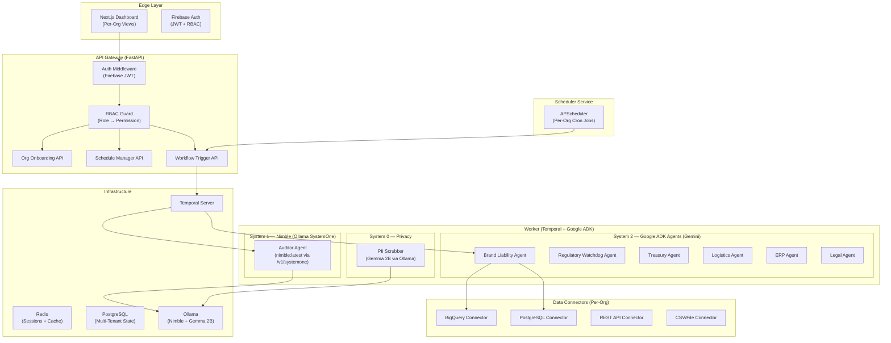

# SynthetIQ v2 — Implementation Plan
### Multi-Tenant Generic Platform with Google ADK, Nimble System 1, and Scheduled Execution

---

## Architecture Overview



---

## Key Design Decisions

### 1. Google ADK over LangChain
- **Why**: Native Gemini integration, typed tools, built-in session/state management, `SequentialAgent` / `ParallelAgent` / `LoopAgent` workflow primitives
- **How**: Each of the 8 agents becomes a `google.adk.agents.LlmAgent` with domain-specific tools
- **Orchestration**: `SequentialAgent` pipelines replace linear Temporal activity chains for intra-workflow agent coordination

### 2. Nimble (Ollama SystemOne) over Jev/IsolationForest
- **Why**: Nimble is a purpose-built 9B decision model for fast typed classification (<100ms). Perfect for System 1 fraud detection (approve/reject/escalate)
- **How**: Uses Ollama's `/v1/systemone` endpoint (not `/api/generate`). Returns typed choices with probability scores
- **Fallback**: IsolationForest ML + physics rules retained as ensemble fallback when Ollama is unavailable

### 3. Multi-Tenant Organization Onboarding
- **PostgreSQL** for persistent org/user/schedule/data-source state
- **Per-org data connectors** (BigQuery, PostgreSQL, REST API, CSV)
- **Tenant-isolated Temporal workflows** (workflow ID includes org_id)

### 4. Scheduled Execution
- **APScheduler** with per-org cron schedules stored in PostgreSQL
- Triggers Temporal workflows on schedule (e.g., daily liability recalc, hourly SCADA audit)
- Supports one-time, daily, weekly, and custom cron expressions

---

## Phase 1: Database & Multi-Tenancy Models

### New Files

| File | Purpose |
|------|---------|
| `packages/synthetiq-shared/src/database.py` | SQLAlchemy async engine + session factory |
| `packages/synthetiq-shared/src/models/organization.py` | Organization, User, DataSource, Schedule ORM models |

### Key Models

```
Organization
├── org_id (UUID)
├── name, industry, settings (JSON)
├── created_at, is_active
│
├── Users (1:N)
│   ├── user_id, email, firebase_uid
│   ├── role (admin | compliance_officer | auditor | viewer)
│   └── org_id (FK)
│
├── DataSources (1:N)
│   ├── source_id, type (bigquery | postgres | rest_api | csv)
│   ├── connection_config (encrypted JSON)
│   └── org_id (FK)
│
└── Schedules (1:N)
    ├── schedule_id, cron_expression, workflow_type
    ├── is_active, last_run_at, next_run_at
    └── org_id (FK)
```

---

## Phase 2: Authentication & RBAC

### Modified Files

| File | Changes |
|------|---------|
| `api/src/services/auth_service.py` | **Rewrite**: Real Firebase Admin SDK `verify_id_token()` |
| `api/src/middleware/auth.py` | **New**: FastAPI `Depends()` middleware for JWT verification |
| `api/src/middleware/rbac.py` | **New**: Role-based permission guard |

### RBAC Matrix

| Role | Orgs | Users | Schedules | Workflows | Audits | Config | Data Sources |
|------|:----:|:-----:|:---------:|:---------:|:------:|:------:|:------------:|
| **admin** | CRUD | CRUD | CRUD | RW | RW | RW | CRUD |
| **compliance_officer** | R | R | R | RW | RW | R | R |
| **auditor** | R | — | — | R | RW | R | — |
| **viewer** | R | — | — | R | R | — | — |

---

## Phase 3: Google ADK Agent Framework

### Modified/New Files

| File | Purpose |
|------|---------|
| `worker/src/agents/base_adk.py` | **New**: ADK agent base utilities, tool registry |
| `worker/src/agents/brand_liability_agent.py` | **Rewrite**: ADK `LlmAgent` with BigQuery tool |
| `worker/src/agents/regulatory_agent.py` | **Rewrite**: ADK `LlmAgent` with document parser tool |
| `worker/src/agents/treasury_agent.py` | **New**: ADK `LlmAgent` for auction optimization |
| `worker/src/agents/logistics_agent.py` | **New**: ADK `LlmAgent` for E-Way/QR verification |
| `worker/src/agents/auditor_agent.py` | **New**: Nimble SystemOne integration |
| `worker/src/agents/erp_agent.py` | **New**: ADK `LlmAgent` for escrow PO creation |
| `worker/src/agents/legal_agent.py` | **New**: ADK `LlmAgent` for Form-1 generation |
| `worker/src/agents/orchestrator.py` | **New**: `SequentialAgent` pipeline composing all 8 agents |

### Agent Architecture Pattern (Google ADK)

```python
from google.adk.agents import LlmAgent, SequentialAgent, ParallelAgent
from google.adk.tools import FunctionTool

# Each agent = LlmAgent with domain-specific tools
brand_liability_agent = LlmAgent(
    name="brand_liability_agent",
    model="gemini-2.0-flash",
    instruction="You are the Brand Liability Agent...",
    tools=[query_erp_sales, calculate_amortization],
)

# Workflow = SequentialAgent pipeline
epr_compliance_pipeline = SequentialAgent(
    name="epr_compliance_pipeline",
    sub_agents=[
        ParallelAgent(name="upstream", sub_agents=[brand_liability_agent, regulatory_agent]),
        treasury_agent,
        ParallelAgent(name="audit", sub_agents=[logistics_agent, auditor_agent]),
        erp_agent,
        legal_agent,
    ],
)
```

---

## Phase 4: Nimble System 1 Fraud Detection

### Modified/New Files

| File | Purpose |
|------|---------|
| `worker/src/services/nimble_service.py` | **New**: Ollama SystemOne client for Nimble |
| `worker/src/services/jev_auditor.py` | **Modify**: Add Nimble as primary detection mode, retain ML+physics as fallback |

### Nimble Integration Pattern

```python
# Uses Ollama /v1/systemone endpoint (NOT /api/generate)
async def evaluate_scada_signature(self, telemetry: dict) -> dict:
    response = await httpx.post("http://ollama:11434/v1/systemone", json={
        "model": "nimble",
        "state": f"SCADA Reading: torque={telemetry['torque_nm']}Nm, "
                 f"PF={telemetry['power_factor']}, power={telemetry['active_power_kw']}kW, "
                 f"melt_rate={telemetry['melt_rate_kg_h']}kg/h",
        "questions": {
            "fraud_verdict": {
                "type": "choice",
                "instructions": "Is this SCADA signature from genuine polymer extrusion or spoofed resistive heaters?",
                "criteria": {
                    "APPROVED": "Genuine induction motor with viscous polymer load",
                    "REJECTED_FRAUD": "Resistive heater spoofing detected",
                    "ESCALATED": "Uncertain, requires manual review"
                }
            },
            "is_genuine_motor": {
                "type": "bool",
                "instructions": "Does the power factor and torque indicate a real induction motor under polymer viscous load?"
            }
        }
    })
    # Returns typed choice + probability scores in <100ms
```

---

## Phase 5: Scheduler Service

### New Files

| File | Purpose |
|------|---------|
| `worker/src/services/scheduler_service.py` | APScheduler with per-org cron jobs |
| `api/src/routes/schedules.py` | CRUD API for schedule management |

### Scheduler Design

```
┌─────────────────────────────────────────────────┐
│  APScheduler (AsyncIOScheduler)                 │
│                                                 │
│  Per-Org Jobs:                                  │
│  ├── COMP-001: "0 2 * * *" → LiabilityWorkflow │
│  ├── COMP-001: "*/30 * * * *" → AuditWorkflow  │
│  ├── COMP-002: "0 6 * * MON" → E2ECompliance   │
│  └── COMP-003: "0 */4 * * *" → AuditWorkflow   │
│                                                 │
│  On trigger → POST /api/v1/compliance/run-e2e   │
│  Or directly → temporal_client.start_workflow() │
└─────────────────────────────────────────────────┘
```

---

## Phase 6: Generic Data Connectors

### New Files

| File | Purpose |
|------|---------|
| `worker/src/services/data_connector.py` | Abstract connector + BigQuery/PG/REST/CSV implementations |

### Connector Interface

```python
class DataConnector(ABC):
    async def query_sales_data(self, org_id, fiscal_year) -> list[dict]
    async def query_telemetry(self, plant_id, time_range) -> list[dict]
    async def write_audit_result(self, audit_data: dict) -> str
    async def health_check(self) -> bool

# Implementations
class BigQueryConnector(DataConnector): ...
class PostgreSQLConnector(DataConnector): ...
class RESTAPIConnector(DataConnector): ...
class CSVFileConnector(DataConnector): ...
```

---

## Updated docker-compose.yml

```yaml
# New services to add:
services:
  ollama:
    image: ollama/ollama:latest
    container_name: synthetiq-ollama
    ports:
      - "11434:11434"
    volumes:
      - ollama_data:/root/.ollama
    # Pull models on startup
    entrypoint: ["/bin/bash", "-c", "ollama serve & sleep 5 && ollama pull nimble && ollama pull gemma2:2b && wait"]

  redis:
    image: redis:7-alpine
    container_name: synthetiq-redis
    ports:
      - "6379:6379"

  app-db:
    image: postgres:15-alpine
    container_name: synthetiq-app-db
    environment:
      - POSTGRES_DB=synthetiq
      - POSTGRES_USER=synthetiq
      - POSTGRES_PASSWORD=synthetiq
    ports:
      - "5433:5432"
```

---

## File Change Summary

| Action | File | Phase |
|:------:|------|:-----:|
| ✨ New | `packages/synthetiq-shared/src/database.py` | 1 |
| ✨ New | `packages/synthetiq-shared/src/models/organization.py` | 1 |
| ✏️ Modify | `api/src/services/auth_service.py` | 2 |
| ✨ New | `api/src/middleware/auth.py` | 2 |
| ✨ New | `api/src/middleware/rbac.py` | 2 |
| ✨ New | `worker/src/agents/base_adk.py` | 3 |
| ✏️ Rewrite | `worker/src/agents/brand_liability_agent.py` | 3 |
| ✏️ Rewrite | `worker/src/agents/regulatory_agent.py` | 3 |
| ✨ New | `worker/src/agents/treasury_agent.py` | 3 |
| ✨ New | `worker/src/agents/logistics_agent.py` | 3 |
| ✨ New | `worker/src/agents/auditor_agent.py` | 3 |
| ✨ New | `worker/src/agents/erp_agent.py` | 3 |
| ✨ New | `worker/src/agents/legal_agent.py` | 3 |
| ✨ New | `worker/src/agents/orchestrator.py` | 3 |
| ✨ New | `worker/src/services/nimble_service.py` | 4 |
| ✏️ Modify | `worker/src/services/jev_auditor.py` | 4 |
| ✨ New | `worker/src/services/scheduler_service.py` | 5 |
| ✨ New | `api/src/routes/schedules.py` | 5 |
| ✨ New | `api/src/routes/organizations.py` | 6 |
| ✨ New | `worker/src/services/data_connector.py` | 6 |
| ✏️ Modify | `worker/src/activities/agent_activities.py` | 3,4,6 |
| ✏️ Modify | `worker/src/flows/workflows.py` | 3 |
| ✏️ Modify | `worker/src/main.py` | 3,4,5 |
| ✏️ Modify | `api/src/main.py` | 2,5,6 |
| ✏️ Modify | `docker-compose.yml` | All |
| ✏️ Modify | `worker/pyproject.toml` | 3 |
| ✏️ Modify | `api/pyproject.toml` | 2 |

---

> [!IMPORTANT]
> **Proceed?** This plan creates/modifies ~27 files. I'll implement them in the phase order above, starting with database models and working through to the scheduler and data connectors.
